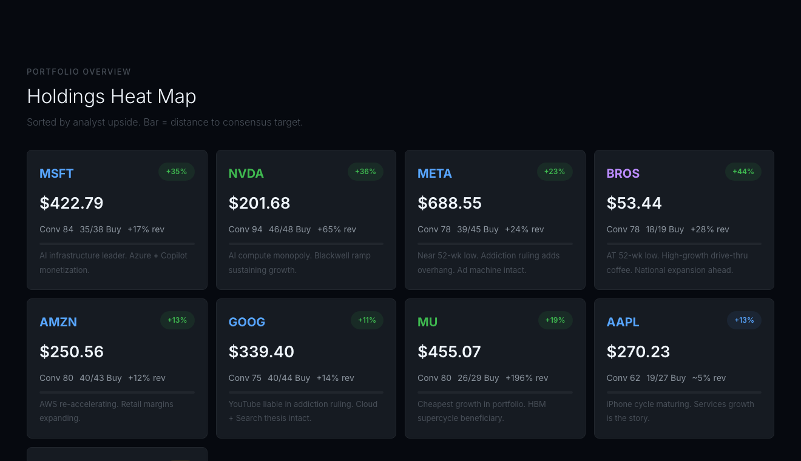
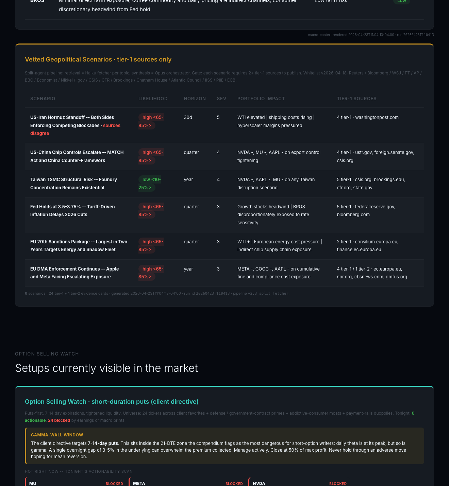
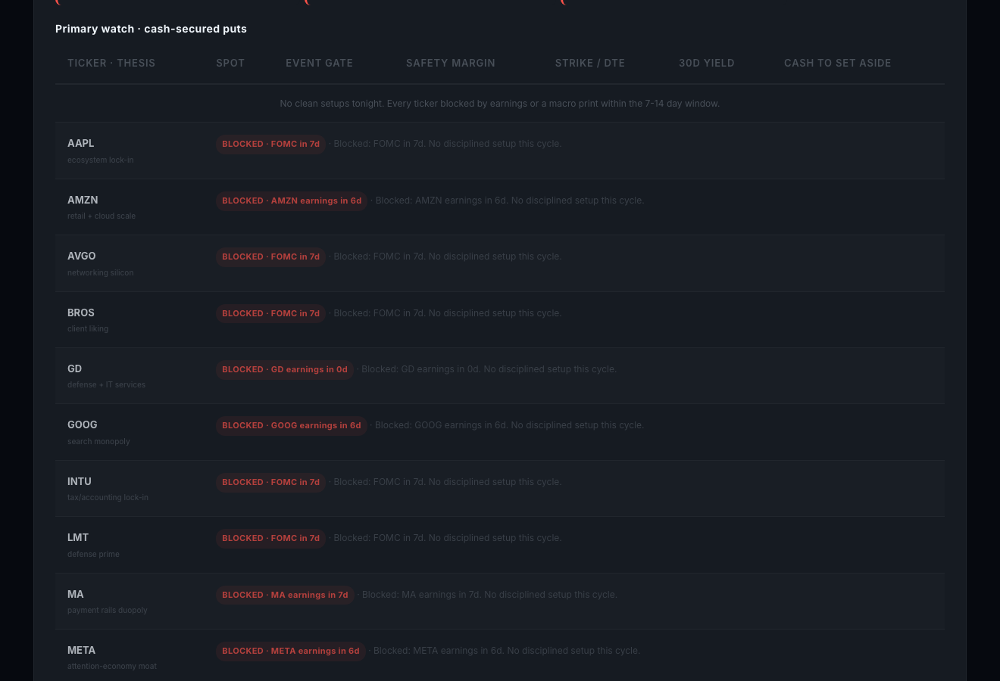

# Prompt AI Solutions
## Stock Analysis Dashboard

**A god-like secretary for premium-selling decisions.**

April 2026 | Andrew McAteer | mcateerandy@gmail.com | promptaisolutions.com
Live dashboard: https://promptaisolutions.com/stock-analysis/

---

## What this tool is

A single-page web dashboard, scoped to one strategy: **selling options
premium on a curated watchlist of names you already know**.

It is free, public, and requires no login. You open it in a browser, scan
it for under two minutes, and decide. It never tells you what to do.

**The watchlist universe (24 tickers, four baskets):**

| Basket | Tickers |
|---|---|
| Mega-cap tech (the original 9) | MU, META, NVDA, MSFT, AMZN, GOOG, AAPL, TSLA, BROS |
| Defense primes | LMT, RTX, NOC, GD, PLTR |
| Addictive consumer staples | PM, MO, STZ, SBUX, NFLX |
| Payment rails and infrastructure | V, MA, INTU, AVGO, OKLO |

Updated automatically twice every weekday during US market hours, then
left alone overnight.

---

## How it works

The dashboard is the rendered output of a small autonomous pipeline that
runs on a fixed schedule. The mechanics, in plain language:

1. **Pull fresh option chains from CBOE** at 10:33 AM and 2:33 PM Eastern,
   Tuesday through Friday. The afternoon slot is deliberately outside the
   3-4 PM ET zero-day-to-expiry reversal window, so the data reflects a
   settled tape rather than a churning one.
2. **Apply an event filter.** Any expiration that spans a known earnings
   release, an FOMC decision, a CPI print, or a non-farm payrolls release
   is dropped. You will never see a setup quoted across an event the
   underwriter cannot price.
3. **Pick the disciplined-seller candidate per ticker.** The spine is
   7 to 14 days to expiry, 0.15 to 0.25 delta, open interest at or above
   500 contracts, bid-ask spread at or under 5%. Names that fail the
   liquidity gate are still shown; they are flagged so you can see why.
4. **Compute the volatility risk premium regime.** Implied volatility
   minus realized volatility. If the premium is compressed, position
   sizing drops to half standard. If it is rich, sizing can step up to
   1.25x with a tail-risk caveat. The regime tile sits at the top of the
   page so it frames every other number.
5. **Render the dashboard.** The page is rebuilt from canonical JSON
   inputs by deterministic Python renderers. Identical input gives
   byte-identical output.
6. **Mike opens his browser, scans, decides.** No sign-in, no account, no
   personalization. The dashboard is the artifact.

A thin daily email accompanies the run, but only when something has
materially changed since the last update. Most days, no email is sent.
The default is silence.

---

## What Mike actually sees

The page opens with the volatility regime band and a 9-card verdict grid
for the original mega-cap basket. Each card shows live price, analyst
target with implied upside, conviction score, and how many bear-case
bullets fresh evidence has knocked down.

A holdings heat map sorts the same names by analyst upside, with one-line
thesis text under each card. This is the scannable "what does the room
look like today" summary.

A vetted geopolitical scenarios panel surfaces the macro events that
could break a sell-premium thesis. Every scenario carries a tier-1 source
count. Anything below two tier-1 sources is dropped from publication, by
design. The panel also surfaces source-level disagreement when it exists,
so you can see the contradiction itself rather than a smoothed-over
consensus.

The Option Selling Watch table is the working surface. Twenty-four rows,
one per ticker. Earnings-blocked and macro-blocked rows are flagged in
red so you can see at a glance how much of the universe is tradable today
and how much is not. Below the watch grid, a primary-watch table shows
the single best cash-secured-put candidate per name when one survives the
event and liquidity gates.

---

## Why this is different from what you already have

Mike's advisory group already has Bloomberg, broker research portals,
retail option screeners, and decades of pattern recognition. The
dashboard does not try to compete with any of them on coverage. It
competes on **scope and posture**.

| You already have | What it gives you | Where this dashboard differs |
|---|---|---|
| **Bloomberg terminal, broker research portals** | Encyclopedic coverage. Everything about everything. | Opinionated about the universe and the strategy. Less surface area, more actionability. You stop scrolling sooner. |
| **Retail option screeners (Barchart, OptionStrat)** | Screen the entire option universe by criteria. | Scoped to twenty-four names you already follow. Chaos-aware: rows are not just sorted by yield, they are flagged by event proximity and liquidity. |
| **Analyst research, newsletters** | Tell you what to buy. | Never tells you what to do. Surfaces the live options market and lets you decide. |
| **Roll-your-own spreadsheets** | Exactly what you want, until you stop maintaining them. | Autonomous. Fresh every market session without a human in the loop. |

### The secretary framing

A competent secretary does not tell the boss what to do. She knows
everyone in the room, has the agenda ready, anticipates needs, and makes
the boss's day flow.

This dashboard is that secretary, scoped to options selling. It pulls the
chains. It blocks earnings-spanning expirations. It flags compressed
volatility regimes that should shrink position sizing. It surfaces
Thursday-optimal weekend-theta candidates. It tells you nothing about
what to trade.

That posture matters more than any single feature. A Bloomberg-using
professional who reads "buy this, sell that" three hundred times a day
has every reason to ignore the three-hundred-and-first source. A surface
that earns ninety seconds of attention is a surface that respects the
operator's judgment.

---

## A typical Mike session

It is Thursday, 10:35 AM Eastern. Mike opens the dashboard on his phone
over coffee.

The regime tile reads **VRP compressed, 0.5x size**. He internalizes
that. Whatever he writes today, he writes half size.

He scans the Option Selling Watch table. Nineteen of twenty-four rows are
flagged red: **FOMC in 7d. No disciplined setup this cycle.** Three rows
are flagged for individual earnings within the window. Two rows are
clean.

Both clean rows carry a **THU-OPT** badge: today is Thursday and a
next-Friday expiry exists, which means the contract decays through a
weekend without market hours. Sellable.

He taps the higher-yield row, opens his broker on the same phone, places
a half-size cash-secured put. Done.

Total elapsed time: ninety seconds. The dashboard never told him to
trade. It told him which rows were not blocked and which carried the
weekend-theta tailwind. He decided.

---

## Privacy and safety

The public dashboard never shows holdings, share counts, cash balances,
cost basis, or assignment events. None of that is on the URL above and
none of it ever will be. Personalization, when it exists at all, happens
only in a private email path that Mike opted into.

The tool drafts no emails on its own without review. It places no
trades. It has no broker connection. It moves no money. It is a read-only
artifact rendered to a static page, and a private email draft that
Andrew reviews before sending.

Mike's advisory peers can use the same dashboard at the same URL.
Nothing on it is personalized to him. Anyone landing on the page sees
exactly what he sees.

**Disclosures:** the dashboard is educational and is not financial
advice. Every reader makes their own decisions. The site carries explicit
"limitations" copy in its header for the same reason.

---

## If your group wants a similar dashboard

The pattern -- one strategy, a curated watchlist, an autonomous pipeline,
a scannable single page, no opinions -- generalizes. If a member of
Mike's advisory group wants a version scoped to their own universe and
their own strategy (covered-call writing on dividend names, cash-secured
puts on industrials, calendar spreads on commodity ETFs, anything else
where the operator is the decision maker and the dashboard is the
secretary), the build is straightforward.

Talk to Andrew.

**Andrew McAteer** | mcateerandy@gmail.com | promptaisolutions.com
Live reference dashboard: https://promptaisolutions.com/stock-analysis/
